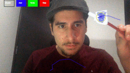
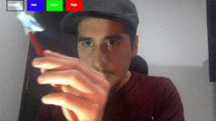
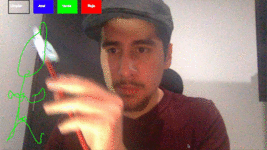

# Air Camboard

Color tracking to generate board on camera.

## Uso

1. Run script.
```
python aircamboard.py
```
2. Use any blue object as a drawing tool (It is recommended to use a colored paper, on the tip of a common pencil).
3. Select colors to draw or clean.

## Demo


